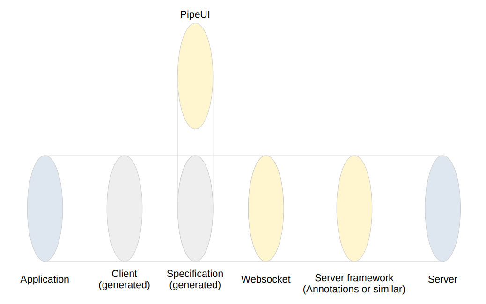

# PipeApi
Websocket API specification, tooling and examples

## Overview


- Server: Written by developer(s) using "Server framework" provided by PipeApi
- Server framework: Written to automatically generate a "Specification" for the communication
- Websocket: The communication channel
- Specification: Automatically generated from the code in "Server" using the "Server framework"
- PipeUI: Web UI, autogenerated from the "Specification"
- Client: PipeApi will have tooling to generate language specific clients from the "Specification"
- Appliction: Written by developer(s) using the generated "Client"

## Example usages
TODO

## Example projects
TODO

## Scalability
TODO Single-pipe:
```
/api/singlePipe: {
    dataA: {...},
    dataB: {...},
    dataC: {...}
}
```
TODO Multi-pipe:
```
/api/pipeA: { dataA: {...} }
/api/pipeB: { dataB: {...} }
/api/pipeC: { dataC: {...} }
```
